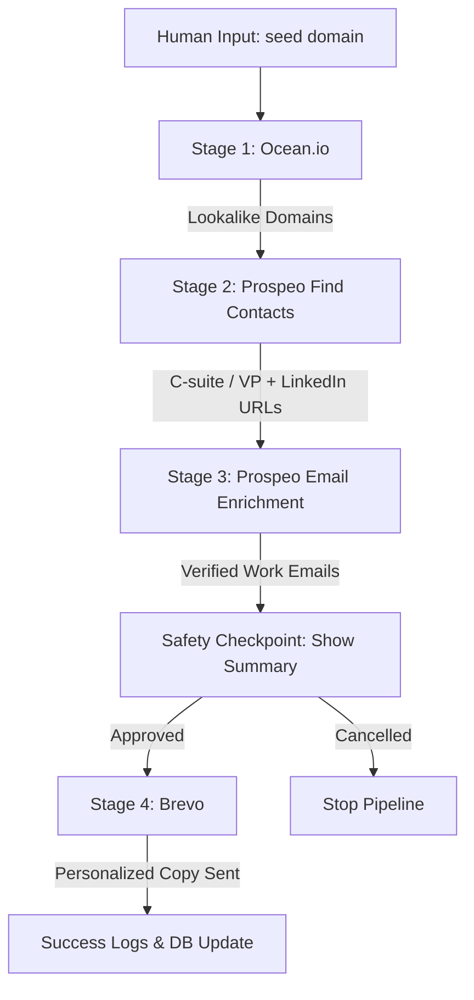

# B2B Automated Outreach Pipeline

An automated B2B cold-outreach pipeline that runs end-to-end: mapping lookalike companies, extracting C-suite/VP decision-makers, resolving verified business emails, and sending personalized outreach emails via Brevo. Built with a safety confirmation checkpoint and robust error resiliency.



---

## Key Features

1. **Fully Automated, Hands-off Flow**: Run a single command with one seed domain, and the entire pipeline executes from company sourcing to email generation.
2. **Safety Gate Confirmation**: Displays a detailed table showing all lookalikes, contact names, verified work emails, and personalized subject lines. The system prompts for confirmation before firing any emails.
3. **De-duplication & Local History**: Uses a local SQLite database (`outreach_history.db`) to ensure:
   - No contact email is messaged twice.
   - No company domain is contacted more than once in a 30-day window (configurable).
4. **Resiliency**: Built using exponential backoff retries (`tenacity`) to handle transient errors, network timeouts, and rate limits (`429`).
5. **Dry Run / Mock Mode**: Runs using synthetic lookalike profiles and generated emails if you don't provide API keys or if you supply the `--dry-run` flag, making it safe and easy to demo without spending credits.

---

## Project Structure

```text
.
├── config/
│   └── settings.py          # Handles config validation (python-dotenv)
├── core/
│   ├── pipeline.py          # Main orchestrator running stages 1 to 4
│   └── history.py           # Handles SQLite database de-duplication
├── integrations/
│   ├── base.py              # Base HTTP client with retries and rate limit handlers
│   ├── ocean.py             # Ocean.io lookalike search client
│   ├── prospeo.py           # Prospeo decision-maker lookup & enrichment client
│   └── brevo.py             # Brevo transactional email client
├── templates/
│   └── outreach.py          # Personalized email HTML generator
├── main.py                  # CLI entrypoint built using Click and Rich
├── .env.example             # Template for API keys
├── requirements.txt         # Package dependencies
└── README.md                # Documentation (this file)
```

---

## Setup & Installation

### 1. Clone & Install Dependencies
Ensure you have Python 3.8+ installed.

```bash
# Clone the repository and navigate into the workspace
git clone https://github.com/hot-take/1input-email-outreach.git
cd 1input-email-outreach

# Create a virtual environment
python -m venv venv
venv\Scripts\activate

# Install requirements
pip install -r requirements.txt
```

### 2. Configure Environment Variables
Copy `.env.example` to `.env` and fill in your API credentials:

```bash
copy .env.example .env
```

Open `.env` and update the keys:
```env
# Ocean.io API Settings
OCEAN_API_KEY=your_ocean_api_key
OCEAN_API_URL=https://api.ocean.io/v3

# Prospeo API Settings
PROSPEO_API_KEY=your_prospeo_api_key

# Brevo API Settings (For Email Sending)
BREVO_API_KEY=your_brevo_api_key
BREVO_SENDER_EMAIL=sender@yourdomain.com
BREVO_SENDER_NAME="Your Name"

# General Config
DRY_RUN=false
DB_PATH=outreach_history.db
```

---

## Usage Guide

### Run Sourcing and Enrichment in Mock/Dry-Run Mode
If you do not have API keys yet, you can run in **Dry Run Mode**. This uses predefined mock databases to simulate the exact behavior of Ocean.io, Prospeo, and Brevo:

```bash
python main.py stripe.com --dry-run
```
*(Common supported seed domains with specific mock datasets: `stripe.com`, `hubspot.com`, `slack.com`, `vocallabs.com`, `google.com`)*

### Run Production Outreach
To execute a live outreach pipeline with real API requests and real emails:

```bash
python main.py stripe.com --no-dry-run
```

### Options
- `--dry-run` / `--no-dry-run`: Force override the execution mode.
- `--dedup-days <int>`: Set the number of days to wait before contacting the same company domain again (default is `30`).

---

## Troubleshooting & Logs

All pipeline execution steps, API statuses, and errors are written to `outreach_pipeline.log`. If you hit rate limits, timeouts, or want to check raw payloads, check this log file:

```bash
# View logs on Windows PowerShell
Get-Content -Path .\outreach_pipeline.log -Tail 50 -Wait
```
